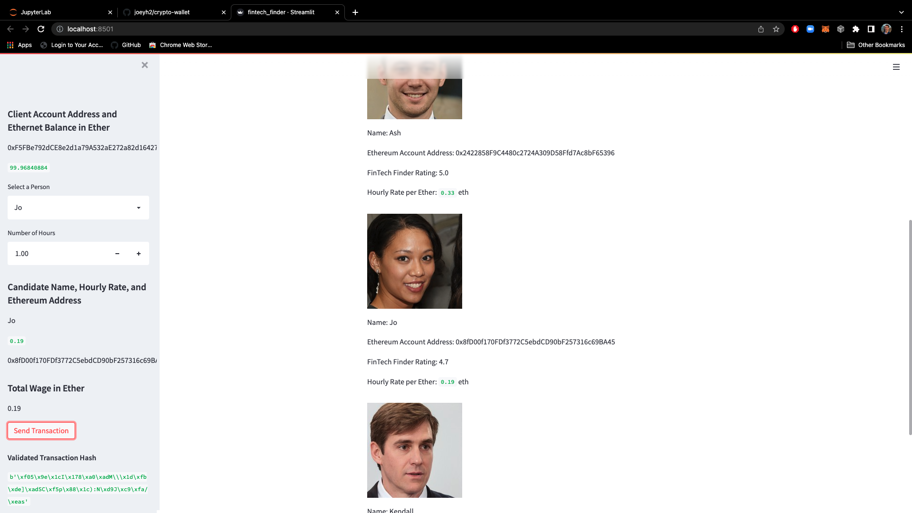
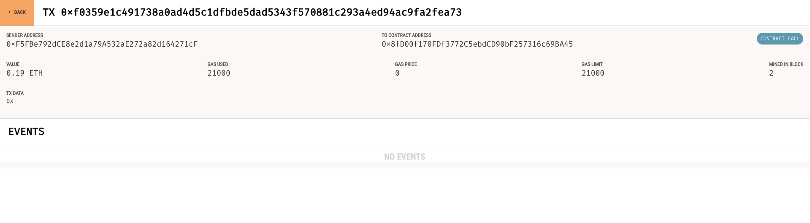
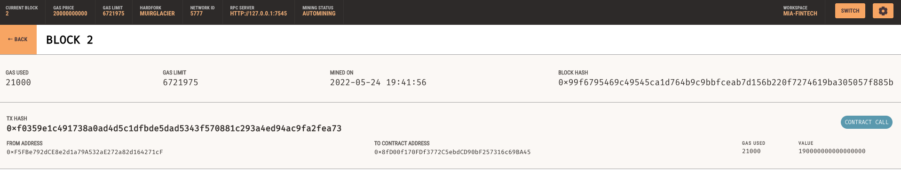
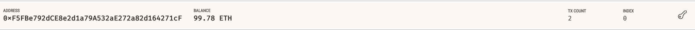

# Crypto Wallet
## Using Python and Streamlit

### Here is the streamlit interface after eth sent to Jp with validation hash in bottom left

### Here is the transaction on my Ganache local

### Here is the recipient detail

### Here is my new balance (please note, my balance began at just under 100 before this transaction was performed)

